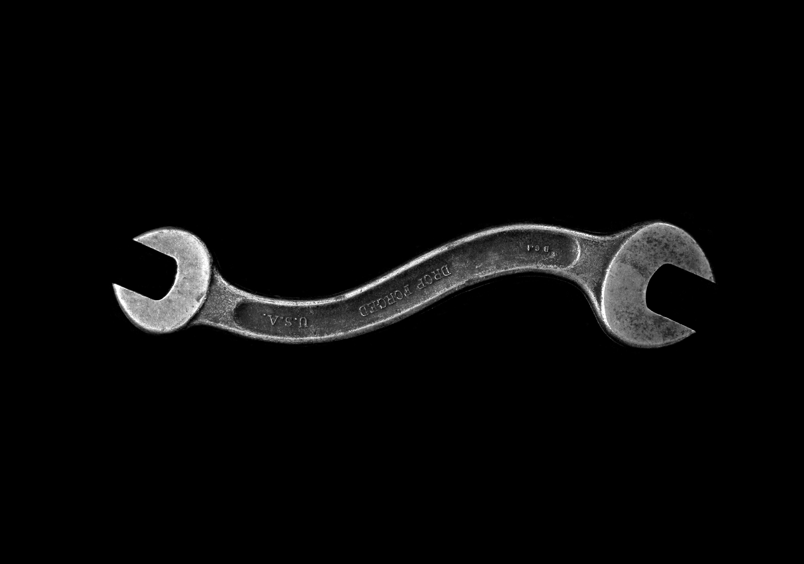

# Getting Node.js Testing

How one can do TDD (test-driven development) the right way; and how one should approach testing Node.js applications.

Test driven development is a methodology for writing the tests first for a given module and for the actual implementation afterward. If one write your tests before your application code, that saves one from the cognitive load of keeping all the implementation details in mind, for the time one have to write your tests. At least for me, these are the two best things in it. We always found it hard to remember all the nitty-gritty details about the code that We had to test later.

With TDD We can focus more on the current step that we are taking. It consists of 3 steps:

1. writing failing tests
2. writing code that satisfies our tests
3. and refactor.

## Tools and Utilities

- Test runner: [Mocha](https://mochajs.org/)
- Assertions: [Chai](http://chaijs.com/)
- Stubs/Mocks: [Sinon](http://sinonjs.org/)
- [Chai-As-Promised](https://github.com/domenic/chai-as-promised)
- [Sinon-Chai](https://github.com/domenic/sinon-chai)

## Reference

- https://blog.risingstack.com/getting-node-js-testing-and-tdd-right-node-js-at-scale/
- https://medium.com/@joantolos/6-tools-to-help-one-do-tdd-with-nodejs-70d19a9ca041
- Photo by https://unsplash.com/photos/lt2GzPlOAmc
